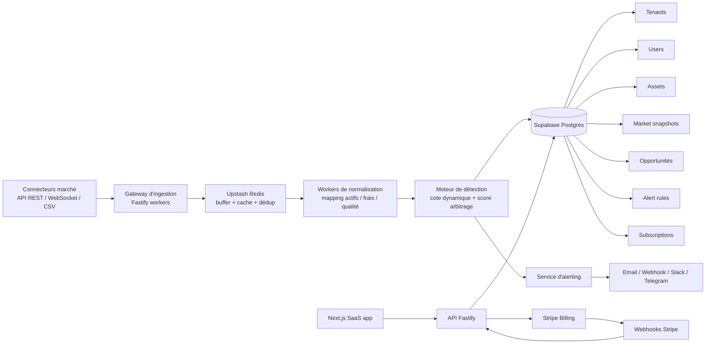

# MVP SaaS radar d'arbitrage

## Stack retenue

| Domaine | Choix | Pourquoi c'est le bon standard MVP |
|---|---|---|
| Frontend | `Next.js 15` + `React 19` + `TypeScript` + `Tailwind CSS 4` + `shadcn/ui` | Stack la plus rapide à mettre en ligne pour un SaaS B2B moderne, SSR/streaming natifs, DX excellente, SEO correct, design system rapide à assembler. |
| Backend API | `Node.js 22` + `Fastify` + `TypeScript` + `Zod` | Très bon débit, surface simple, validation stricte des contrats, coût d'hébergement bas, déploiement rapide sans complexité de framework lourd. |
| ORM / accès DB | `Drizzle ORM` | Typage propre, migrations lisibles, overhead faible, meilleur compromis simplicité/robustesse pour un micro-SaaS. |
| Base de données | `Supabase Postgres` | Postgres managé, Auth, stockage, RLS, backups, observabilité de base. Pour un MVP multi-tenant, c'est le meilleur ratio vitesse/coût/fiabilité. |
| Temps réel / queue / cache | `Upstash Redis` | File légère, buffer temps réel, cache de snapshots, anti-doublons, rate limiting. Suffisant avant de justifier Kafka ou NATS. |
| Workers d'ingestion et détection | Service Node séparé, déployé indépendamment de l'API web | Sépare le plan de contrôle SaaS du pipeline marché, permet de scaler les workers sans toucher au frontend. |
| Auth & multi-tenant | `Supabase Auth` + `Postgres RLS` | Le plus sûr et le plus économique pour isoler les données par `tenant_id` sans réinventer l'authentification. |
| Facturation | `Stripe Billing` | Référence absolue pour abonnements, essais, webhooks, coupons, gestion d'échec de paiement et portail client. |
| Alerting | `Resend` pour email + webhooks sortants + option Telegram/Slack | Simple, peu coûteux, très rapide à brancher, bon canal initial pour monétiser les alertes. |
| Hébergement | `Vercel` pour le frontend + `Railway` ou `Fly.io` pour API/workers | Déploiement ultra-rapide, coûts contenus, séparation propre des composants. |
| Observabilité | `Sentry` + logs structurés JSON | Indispensable dès le MVP pour diagnostiquer les faux positifs, les retards d'ingestion et les incidents de facturation. |

## Décision d'architecture

Le bon compromis pour un micro-SaaS rentable est une architecture en deux plans :

- `control plane` : application SaaS, comptes, abonnements, configuration des alertes, dashboard, RBAC
- `data plane` : ingestion de flux, normalisation, calcul de cote dynamique, scoring d'anomalies, diffusion d'alertes

Cela évite de surcharger l'app web avec le temps réel, tout en restant beaucoup plus simple et moins coûteux qu'une architecture distribuée lourde.

## Schéma conceptuel

## Isolation multi-tenant

Principe :

- toutes les tables métier exposées au SaaS portent `tenant_id`
- `Row Level Security` activée sur les tables de lecture/écriture applicatives
- séparation logique entre données “globales marché” et données “tenant”

Répartition conseillée :

- tables globales : `assets`, `venues`, `market_snapshots`, `fair_values`
- tables tenant : `alert_rules`, `subscriptions`, `deliveries`, `saved_opportunities`, `team_members`

Modèle pratique :

- le moteur calcule des opportunités globales
- chaque tenant ne reçoit que les anomalies compatibles avec son plan, ses filtres et ses règles d'alerte
- les quotas et fréquences d'envoi sont appliqués au niveau tenant

## Pipeline de détection

1. Ingestion des ticks / transactions / carnets.
2. Normalisation des symboles, conversion des devises, enrichissement des frais et de la liquidité.
3. Construction d'une `cote dynamique` par actif à partir d'un prix de référence robuste pondéré.
4. Calcul du `net executable price` achat/vente par venue après frais, spread et slippage.
5. Détection des écarts inter-venues.
6. Scoring par potentiel économique réel :
   - edge net après coûts
   - confiance de la cote
   - profondeur disponible
   - persistance temporelle
   - volatilité récente
7. Filtrage par seuils métier.
8. Publication des alertes selon le plan d'abonnement.

## Pourquoi cette stack gagne

- Elle est moderne sans être expérimentale.
- Elle est déployable en quelques jours, pas en quelques semaines.
- Elle garde un coût fixe faible tant que le volume de flux reste raisonnable.
- Elle permet d'évoluer plus tard vers `ClickHouse`, `Kafka` ou un moteur temps réel plus lourd sans réécrire le produit SaaS.

## Évolution après PMF

Quand le produit commence à saturer :

- migrer l'historique massif vers `ClickHouse`
- garder `Supabase Postgres` pour le transactionnel SaaS
- remplacer une partie du buffer Redis par un vrai bus d'événements si le débit le justifie
- introduire un moteur de scoring ML uniquement après validation du signal économique
